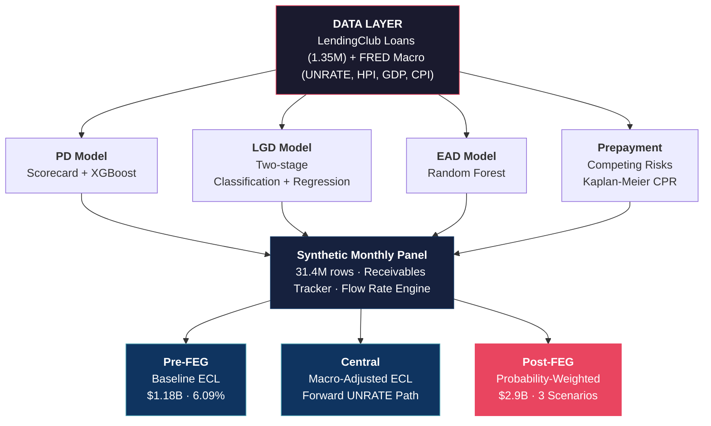

# CECL Credit Risk Analytics — LendingClub Portfolio

End-to-end **CECL-compliant** credit risk platform for a **$11.7B LendingClub consumer lending portfolio** (1.35M loans, 2007–2018). Built using the same institutional frameworks used in production ALLL/CECL workflows at major financial institutions — PD/LGD/EAD modeling, synthetic receivables tracking, forward default flow rates, macro stress testing, and probability-weighted ECL across Pre-FEG, Central, and Post-FEG views.

## Key Results

| Metric | Value |
|--------|-------|
| **Portfolio** | $11.7B funded amount, 1,345,350 loans, 7 credit grades |
| **PD Scorecard** (Logistic Regression) | AUC **0.693**, Gini 38.6%, KS 28.1% — 13 WoE features |
| **PD ML Ensemble** (XGBoost) | AUC **0.720** — 50 SHAP-selected features from 101 |
| **LGD Model** (Two-stage) | MAE **7.6%**, portfolio mean 88.4% |
| **EAD Model** (Random Forest) | MAPE **8.3%** |
| **DCF-ECL** (Pre-FEG baseline) | $1.18B — 6.09% ALLL ratio |
| **Post-FEG ECL** (probability-weighted) | **$2.9B** — 64.6% variance under macro stress |
| **Population Stability** | All PSI < 0.04 (GREEN) across test periods |

## Architecture



## Project Structure

```
├── notebooks/
│   ├── 01_EDA_and_Data_Cleaning.ipynb        # Data profiling, cleaning, FRED macro merge
│   ├── 02_WOE_IV_Feature_Engineering.ipynb   # WoE/IV binning, feature selection
│   ├── 03_PD_Scorecard_with_Grade.ipynb      # Logistic regression PD scorecard
│   ├── 04_PD_Model_ML_Ensemble.ipynb         # XGBoost/LightGBM + SHAP analysis
│   ├── 055_Prepayment_Model.ipynb            # Kaplan-Meier CPR, competing risks
│   ├── 05_EAD_Model.ipynb                    # Exposure at Default
│   ├── 06_LGD_Model.ipynb                    # Loss Given Default (two-stage)
│   ├── 07_ECL_and_Flow_Rates.ipynb           # Receivables tracker, DCF-ECL engine
│   ├── 08_Model_Validation_and_Monitoring.ipynb  # PSI/CSI/Gini/KS, RAG framework
│   └── 09_Macro_Scenarios_and_Strategy.ipynb # 3-scenario stress testing, FEG views
│
├── src/                          # Modular Python package
│   ├── ecl_engine.py             # DCF-ECL computation with competing risks
│   ├── flow_rates.py             # Forward default flow rates from receivables tracker
│   ├── macro_scenarios.py        # Multi-quarter UNRATE paths, stress multipliers
│   ├── models.py                 # PD/LGD/EAD model wrappers
│   ├── scorecard.py              # WoE scorecard scoring engine
│   ├── validation.py             # Discrimination, calibration, stability metrics
│   └── woe_binning.py            # Weight of Evidence binning framework
│
├── data/
│   ├── results/                  # All outputs: visualizations, tables, metrics
│   ├── processed/                # Cleaned parquets, train/val/test splits
│   └── raw/                      # Original LendingClub CSV (not tracked)
│
├── docs/                         # Project documentation and roadmap
├── config.py                     # Centralized paths and constants
└── requirements.txt
```

## Methodology

### PD Modeling — Dual Approach

**Logistic Regression Scorecard** — Behavioral monitoring model using WoE/IV feature engineering. Grade is included as an origination-time attribute; `int_rate` and `sub_grade` are excluded to avoid circularity. 13 features selected via IV >= 0.05 and pairwise correlation < 0.70. L2 regularization tuned via 5-fold stratified CV. Test AUC 0.693 with temporal split (train 2007–2015, test 2017–2018) — consistent with published benchmarks for origination-only features without leakage.

**XGBoost Ensemble** — Performance ceiling model including all 101 features (macro, borrower, loan, bureau). Optuna-tuned. SHAP-based feature selection reduces to 50 features with < 0.1% AUC loss. Test AUC 0.720. SHAP analysis reveals UNRATE, HPI, and DFF as retained macro drivers.

### LGD — Two-Stage Model

Stage 1 classifies P(any recovery) via logistic regression. Stage 2 predicts recovery rate conditional on recovery via gradient boosting. Combined: LGD = 1 − P(recovery) × E[recovery_rate | recovery]. Portfolio mean LGD of 88.4% aligns with unsecured consumer credit benchmarks.

### ECL — DCF with Competing Risks

Monthly cash flow projection where each loan faces three outcomes per period: stay current, default, or prepay. Cash flows discounted at effective interest rate. ECL = NPV(contractual) − NPV(expected). Prepayment rates from Kaplan-Meier survival analysis (CPR lookup by term × grade × vintage). Baseline DCF-ECL of 6.09% ALLL benchmarks within 0.39pp of LendingClub's reported 5.7%.

### Forward Default Flow Rates

Synthetic monthly panel (31.4M rows) reconstructed from loan-level terminal outcomes. Receivables tracker in institutional format: monthly dollar balances across 7 DPD buckets (Current, 30+, 60+, 90+, 120+, 150+, 180+) with GCO, Recovery, and NCO. Flow rates are forward-only (curing is unobservable from this dataset). Flow Through Rate tracks cumulative delinquency progression as a product of all intermediate flow rates.

### Macro Stress Testing — 3 Scenarios

Multi-quarter forward UNRATE paths over 8-quarter projection horizon:

| Scenario | UNRATE Path | Weight |
|----------|-------------|--------|
| **Central** | Actual 2019 FRED data (~3.5%, declining from 4.6% baseline) | 60% |
| **Mild Downturn** | Rise to 6.0%, then mean reversion | 25% |
| **Stress** | Rise to 10.0%, then mean reversion | 15% |

Time-varying stress multipliers applied at the flow rate level (not output-level), preserving non-linear compounding dynamics. Post-FEG ECL is the probability-weighted blend across all scenarios.

### Model Validation

Comprehensive monitoring framework: Gini, KS, AUC with bootstrap confidence intervals, Hosmer-Lemeshow calibration, PSI/CSI/VDI stability testing, and RAG status reporting. All population stability indices GREEN (PSI < 0.04) across 2017–2018 test periods.

## Data

**Source**: [LendingClub Loan Data](https://www.kaggle.com/datasets/wordsforthewise/lending-club) — `accepted_2007_to_2018Q4.csv` (2.26M rows, 151 columns). After filtering to terminal statuses (Fully Paid + Charged Off/Default): 1,345,350 loans.

**Macro variables** merged from FRED API by origination month: unemployment rate (UNRATE), Case-Shiller HPI, GDP growth, CPI, Federal Funds Rate, and consumer sentiment.

**Important**: The public LendingClub dataset provides loan-level terminal outcomes, not monthly payment tapes. The synthetic monthly panel is reconstructed from origination dates, last payment dates, and terminal statuses. In production, this framework would use observed monthly payment data directly.

## Setup

```bash
git clone https://github.com/harshvardhan-sekar/lendingclub-credit-risk.git
cd lendingclub-credit-risk

python -m venv venv
source venv/bin/activate
pip install -r requirements.txt

# Download data
python download_data.py

# Run notebooks sequentially (01 through 09)
jupyter notebook
```

## License

MIT
